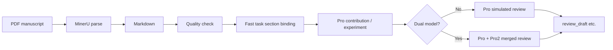

# Academic Review Assistant

> **Version 0.1.0** · Initial release

**Language / 语言:** [English](README.en.md) · [简体中文](README.zh-CN.md)

A locally run **pre-submission self-check** and **simulated peer-review** assistant for **authors**: examine manuscripts you **lawfully own or are authorized to use** from common reviewer perspectives, and produce structured self-check results and **simulated** review drafts. **Not** a substitute for formal journal/conference peer review, and **not** designed for official review workflows.

**License:** MIT — retain copyright notice and attribute this project when redistributing or deriving (see [LICENSE](LICENSE)).

## Disclaimer

- **For authors**: Use before submission to self-check **your own** papers and improve writing, contribution framing, and experiment presentation with **simulated** multi-model feedback.
- **Not for official reviewers**: This project **does not encourage or support** uploading **others’ unpublished manuscripts** obtained through formal review duties (including single-/double-blind review materials, embargoed preprints, etc.) to this tool or its third-party services (e.g. MinerU, LLM APIs). Such use typically violates confidentiality obligations and most venues’ AI policies.
- **Third parties & compliance**: The pipeline sends PDF content to configured cloud parsing and model services. Confirm your use complies with target journal, conference, funder, and institutional rules; you bear the compliance risk.

By using this tool you confirm you are processing manuscripts you may self-check (or materials with explicit authorization) and accept compliance responsibility.

## Workflow

A full run starts from **your PDF** and writes intermediate results and reports under `data/runs/<paper_name>_<timestamp>/`. Completed step outputs are kept; resume after interruption with `--work-dir` (**skip existing outputs**). MinerU parsing is cached by PDF hash in `data/cache/mineru/`.



| Stage | Purpose | Model / component | Main outputs |
|-------|---------|-------------------|--------------|
| 1. Parse | PDF → structured Markdown | MinerU cloud API (cacheable) | `<paper_name>.md` |
| 2. Quality check | Rule-based parse usability | Local rules | `quality_report.md` (abort if too low) |
| 3. Section map | Fast binds multiple headings per task (contribution / experiment / review), char ranges | **Fast** LLM | `section_map.json` |
| 4. Contribution | Section excerpts, innovation & framing | **Pro** LLM | `contribution.md` |
| 5. Experiment | Section excerpts, design & results | **Pro** LLM | `experiment.md` |
| 6. Simulated review | Uses prior analysis + `section_map` sections | **Pro**; with `PRO2_*`, Pro + Pro2 merged | `review_draft.md`; with `OUTPUT_LANG=zh`, also `review_draft_zh.md` |

**Two simulated-review modes**

- **Single model** (default): no `PRO2_*`, or run with `--no-compare` → **Pro** only → one `review_draft.md`.
- **Dual model** (`PRO2_*` set): **Pro** and **Pro2** each draft a review, then **Pro** merges into **one** `review_draft.md` (same points merged; non-conflicting differences kept; conflicts labeled Expert 1 / Expert 2).

Authors usually read first: `contribution.md`, `experiment.md`, `review_draft.md` (or `review_draft_zh.md`), then revise before submission.

### Resume & re-run a step

- With `run --work-dir data/runs/<folder>`, the pipeline **uses only the PDF in that workspace**; a simultaneous `pdf_path` is ignored (warning logged).
- If a step’s output exists, that step is **skipped**. To re-run, delete the file first, e.g.:
  - Re-run section map: delete `section_map.json` (downstream steps re-run unless their outputs are deleted too)
  - Switch single → dual merge: delete `review_draft.md` (and `review_draft_zh.md` if re-translation needed)
  - Quality failed but Markdown replaced: delete `quality_report.md` or re-run parsing
- Log lines `Step 1`–`Step 6` match the table above.

**Preflight** runs before the pipeline (same family as `check-env`), validating MinerU / Fast / Pro (and Pro2 when dual). Exit on failure. Dev: `LLM_STUB=1` or `run --skip-preflight`.

## Quick start

### Windows

```bash
python -m venv .venv
.venv\Scripts\activate
pip install -r requirements.txt
copy .env.example .env
```

### Linux / macOS

```bash
python3 -m venv .venv
source .venv/bin/activate
pip install -r requirements.txt
cp .env.example .env
```

Configure `.env`:

| Variable | Description |
|----------|-------------|
| `MINERU_API_TOKEN` | Required (PDF parsing), [apply](https://mineru.net/apiManage/token) |
| `FAST_*` | Required (multi-heading binding per task → `section_map.json`) |
| `PRO_*` | Required (contribution / experiment / simulated review) |
| `PRO2_*` | Optional; enables dual-model merge by default |

```bash
# Check APIs
python main.py check-env

# Full pipeline
python main.py run path/to/paper.pdf

# Legacy (same as run)
python main.py path/to/paper.pdf

# Resume
python main.py run --work-dir data/runs/PaperName_20260101_120000

# Single-model review only (skip dual merge)
python main.py run paper.pdf --no-compare

# List / clean runs
python main.py runs list
python main.py runs clean --older-than-days 7 --dry-run   # preview
python main.py runs clean --older-than-days 7             # delete (CLI deletes by default)
python main.py runs clean --all --dry-run
```

**Cleanup:** CLI `runs clean` **deletes by default** (`--dry-run` previews). MCP `review_clean_runs` defaults to **`dry_run=true`**; set `dry_run=false` to delete.

See [Workflow](#workflow) for workspace and cache layout.

## Output language

| `OUTPUT_LANG` | Behavior |
|---------------|----------|
| `zh` (default) | `review_draft.md` (English) + `review_draft_zh.md` (Simplified Chinese) |
| `en` | `review_draft.md` only |

## MCP (Model Context Protocol)

This project offers both:

| Form | Use |
|------|-----|
| **CLI** | `python main.py run ...` in terminal |
| **MCP Server** | Tools for Cursor / other MCP hosts |

MCP does not replace the CLI; it exposes **pre-submission self-check / simulated review** in the IDE (`review_run_pdf`, `review_resume`, `review_check_env`, etc.). **Authors’ own manuscripts only** — do not upload others’ unpublished papers from review assignments.

### Enable in Cursor

1. `pip install -r requirements.txt` (includes `fastmcp`)
2. `.cursor/mcp.json` is included; opening the repo loads the `review-agent` server
3. If Python is not on PATH, set full path in Cursor **Settings → MCP**, e.g. `C:/Python313/python.exe`

Manual start (debug):

```bash
python run_mcp.py
# or
python main.py mcp
```

### MCP tools

| Tool | Description |
|------|-------------|
| `review_check_env` | API preflight |
| `review_run_pdf` | Full pipeline on new PDF (long-running) |
| `review_resume` | Resume from `data/runs/...` |
| `review_list_runs` | List past runs |
| `review_clean_runs` | Clean runs (default dry-run) |
| `review_run_status` | Files produced in a run |
| `review_read_report` | Read report content from a run |

Implementation: `review_agent/mcp_server.py` ([FastMCP](https://github.com/PrefectHQ/fastmcp) + stdio).

## Development

- All LLM calls go through `review_agent/llm/base.py` subclasses.
- MinerU is cloud API only; see `review_agent/parser/mineru_parser.py`.
- CLI and MCP share `review_agent/service.py`.
- Redistributions and derivatives must follow attribution in [LICENSE](LICENSE).
