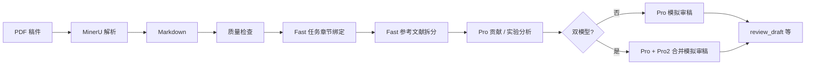

# Academic Review Assistant

> **Version 1.1.0** · 参考文献拆分与独立 PDF→MD 转换

**Language / 语言:** [English](README.en.md) · [简体中文](README.zh-CN.md)

本地运行的**投稿前自查**与**模拟审稿人**辅助工具：帮助**作者**在投稿前，从常见审稿人视角审视**自己拥有合法使用权的稿件**，产出结构化自查结果与**模拟**审稿意见草稿。**不能**替代期刊/会议的正式同行评议，也**不是**为正式审稿流程设计的工具。

**License:** MIT — 二次开发或再分发须保留版权声明并标注本项目来源（见 [LICENSE](LICENSE)）。

## 声明

- **面向作者**：推荐在投稿前对**自有**论文做自查，并借助多模型生成的**模拟**意见改进写作、贡献表述与实验呈现。
- **不面向正式审稿人**：本项目**不鼓励、不支持**正式审稿人将审稿任务中获得的**他人未发表稿件**（含单盲/双盲审稿材料、预印本受保密约束的版本等）上传至本工具或其调用的第三方服务（如 MinerU、各类 LLM API）。此类行为通常违反审稿保密义务及多数期刊/会议的 AI 使用政策。
- **第三方与合规**：流水线会将 PDF 内容发送至配置的云端解析与模型服务。使用前请确认你对该稿件的处理符合目标期刊、会议、资助方及所在机构的规定；相关风险由使用者自行承担。

使用本工具即表示你确认：处理的是你有权自查的自有稿件（或已获明确授权的材料），并自行承担合规责任。

## 工作流

一次完整运行从**作者自有的 PDF** 出发，在本地 `data/runs/<论文名>_<时间戳>/` 工作区中依次生成中间结果与报告。各步已生成的文件会被保留，中断后可用 `--work-dir` **断点续跑**（跳过已有输出）。MinerU 解析按 PDF 哈希缓存在 `data/cache/mineru/`。



| 阶段 | 作用 | 模型 / 组件 | 主要产出 |
|------|------|-------------|----------|
| 1. 解析 | PDF → 结构化 Markdown | MinerU 云端 API（可缓存） | `<论文名>.md` |
| 2. 质量检查 | 规则检测解析是否可用 | 本地规则 | `quality_report.md`（过低则中止） |
| 3. 章节识别 | Fast 按任务（contribution / experiment / review）绑定多个 heading，生成字符区间 | **Fast** LLM | `section_map.json` |
| 3b. 参考文献拆分 | Fast 识别参考文献标题并切出；再经 Fast 裁剪附录/表格等非文献内容（原文子串，不改写条目） | **Fast** LLM（两次） | `references.md`（并更新 `section_map.json` 中的 `reference_binding`） |
| 4. 贡献分析 | 按章节摘录精读，评估创新点与表述 | **Pro** LLM | `contribution.md` |
| 5. 实验分析 | 按章节摘录精读，评估实验设计与结果 | **Pro** LLM | `experiment.md` |
| 6. 模拟审稿 | 结合上文分析与 `section_map` 相关章节，生成**模拟**审稿意见 | **Pro**；若配置 `PRO2_*` 则为 Pro + Pro2 双路后合并 | `review_draft.md`；`OUTPUT_LANG=zh` 时另有 `review_draft_zh.md` |

**模拟审稿的两种模式**

- **单模型**（默认）：未配置 `PRO2_*`，或运行加 `--no-compare` → 仅 **Pro** 生成一份 `review_draft.md`。
- **双模型**（配置 `PRO2_*`）：**Pro** 与 **Pro2** 各生成一份模拟意见，再由 **Pro** 合并为**一份** `review_draft.md`（相同意见合并；不互斥的差异保留；互斥处标注 Expert 1 / Expert 2）。

作者通常优先阅读：`contribution.md`、`experiment.md`、`review_draft.md`（或中文版 `review_draft_zh.md`），据此修改稿件后再投稿。

### 断点续跑与重跑某一步

- 使用 `run --work-dir data/runs/<文件夹>` 时，流水线**只使用工作区内的 PDF**，忽略同时传入的 `pdf_path`（会打 warning 日志）。
- 某步输出文件已存在则**跳过该步**；若要重跑，先删除对应文件，例如：
  - 重跑章节识别：删除 `section_map.json`（后续参考文献拆分、贡献/实验/审稿会随之重跑，除非也单独删它们的产物）
  - 仅重跑参考文献拆分：删除 `references.md`（若 `section_map.json` 仍含 `reference_binding` 则无需再调 Fast）
  - 单模型改双模型合并：删除 `review_draft.md`（及需重译时的 `review_draft_zh.md`）
  - 质量检查未通过但已换新 Markdown：删除 `quality_report.md` 或连同 `.md` 一并重跑解析
- 日志中的 `Step 1`–`Step 6` 与上表阶段编号一致。

启动流水线前会执行 **preflight**（与 `check-env` 同类），校验 MinerU / Fast / Pro（及双模型时的 Pro2）是否可用；失败则立即退出。开发调试可用 `LLM_STUB=1` 或 `run --skip-preflight`。

## 快速开始

### Windows

```bash
python -m venv .venv
.venv\Scripts\activate
pip install -r requirements.txt
copy .env.example .env
```

### Linux / macOS

```bash
python3 -m venv .venv
source .venv/bin/activate
pip install -r requirements.txt
cp .env.example .env
```

在 `.env` 中配置：

| 变量 | 说明 |
|------|------|
| `MINERU_API_TOKEN` | 必填（PDF 解析），[申请](https://mineru.net/apiManage/token) |
| `FAST_*` | 必填（按任务维度绑定多个 heading → `section_map.json`） |
| `PRO_*` | 必填（贡献/实验/模拟审稿，按章节精读） |
| `PRO2_*` | 可选；配置后默认双模型模拟审稿合并（见下） |

```bash
# 检查 API 是否可用
python main.py check-env

# 运行完整流程
python main.py run path/to/paper.pdf

# 兼容旧写法（等价于 run）
python main.py path/to/paper.pdf

# 断点续跑
python main.py run --work-dir data/runs/PaperName_20260101_120000

# 跳过双模型合并（仅 Pro 单路模拟审稿）
python main.py run paper.pdf --no-compare

# 列出 / 清理历史 run
python main.py runs list
python main.py runs clean --older-than-days 7 --dry-run   # 先预览
python main.py runs clean --older-than-days 7             # 确认后真删（CLI 默认会删除）
python main.py runs clean --all --dry-run

# 仅 PDF → Markdown（不跑 LLM 审稿步骤）
python main.py convert path/to/paper.pdf
python main.py convert --work-dir data/runs/PaperName_20260101_120000
python main.py convert paper.pdf --quality-check   # 可选：转换后做本地质量检查
```

**清理说明：** CLI 的 `runs clean` **默认直接删除**（加 `--dry-run` 仅预览）。MCP 工具 `review_clean_runs` **默认 `dry_run=true`**，需显式 `dry_run=false` 才会删除。

工作区与缓存说明见上文 [工作流](#工作流)。

## 输出语言

| `OUTPUT_LANG` | 说明 |
|---------------|------|
| `zh`（默认） | `review_draft.md`（英文）+ `review_draft_zh.md`（简体中文） |
| `en` | 仅 `review_draft.md` |

## MCP（Model Context Protocol）

本项目**同时**提供：

| 形态 | 用途 |
|------|------|
| **CLI** | 本地终端直接跑 `python main.py run ...` |
| **MCP Server** | 供 Cursor、OpenAI Codex 及其他 MCP 宿主调用工具 |

MCP 不是替代 CLI，而是在 IDE 里把**投稿前自查 / 模拟审稿**流程暴露为工具（`review_run_pdf`、`review_resume`、`review_check_env` 等）。**仅适用于作者处理自有稿件**；请勿通过 MCP 上传审稿任务中的他人未发表论文。

### 在 Cursor 中启用

1. `pip install -r requirements.txt`（含 `fastmcp`）
2. 项目已包含 `.cursor/mcp.json`，打开本仓库后 Cursor 会加载 `review-agent`（完整审稿）与 `review-pdf2md`（仅 PDF→Markdown）两个 MCP 服务器
3. 若 Python 不在 PATH，请在 Cursor **Settings → MCP** 中把 `command` 改为完整路径，例如 `C:/Python313/python.exe`

手动启动（调试）：

```bash
python run_mcp.py
# 或
python main.py mcp
```

### 在 OpenAI Codex 中启用

完成 [快速开始](#快速开始)（虚拟环境、依赖与 `.env` 配置）后，将下列配置追加到 `~/.codex/config.toml`，即可在 Codex 中注册本项目的 MCP 服务。

将 `<PROJECT_ROOT>` 替换为本仓库的**绝对路径**。Windows 下建议使用正斜杠（例如 `C:/path/to/Review-agent`）。`command` 应指向虚拟环境中的 Python，以确保依赖可用。

```toml
[mcp_servers.review-agent]
command = "<PROJECT_ROOT>/.venv/Scripts/python.exe"
args = ["<PROJECT_ROOT>/run_mcp.py"]
cwd = "<PROJECT_ROOT>"
startup_timeout_sec = 30
tool_timeout_sec = 600

[mcp_servers.review-agent.env]
PYTHONIOENCODING = "utf-8"

[mcp_servers.review-agent.tools.review_check_env]
approval_mode = "approve"

[mcp_servers.review-agent.tools.review_run_pdf]
approval_mode = "approve"

[mcp_servers.review-agent.tools.review_list_runs]
approval_mode = "approve"

[mcp_servers.review-agent.tools.review_run_status]
approval_mode = "approve"

[mcp_servers.review-agent.tools.review_resume]
approval_mode = "approve"

[mcp_servers.review-agent.tools.review_read_report]
approval_mode = "approve"
```

| 配置项 | 说明 |
|--------|------|
| `command` / `args` | 通过项目 venv 中的 Python 启动 `run_mcp.py` |
| `cwd` | 工作目录，使相对路径（`data/runs/`、`.env`）正确解析 |
| `startup_timeout_sec` | 服务启动最长等待 30 秒 |
| `tool_timeout_sec` | 单次工具调用最长 600 秒（10 分钟）；完整 PDF 流程若超时可适当增大 |
| `PYTHONIOENCODING` | Windows 下强制 stdout/stderr 使用 UTF-8 |
| `approval_mode = "approve"` | 所列工具执行前须用户显式确认（推荐，尤其适用于耗时或读写文件的操作） |

Linux / macOS 请将 `command` 改为 `<PROJECT_ROOT>/.venv/bin/python`。

可选：若希望对清理 run 同样要求确认，可追加 `[mcp_servers.review-agent.tools.review_clean_runs]` 并设置 `approval_mode = "approve"`。

修改 `config.toml` 后，请重启 Codex 或重新加载 MCP 配置。

### 仅 PDF → Markdown（Codex / 其他 Agent）

若 Agent **只需要 MinerU 解析**，不需要模拟审稿，请注册独立的 **PDF→MD MCP 服务**（`run_mcp_convert.py`），与完整审稿服务分开配置：

```toml
[mcp_servers.review-pdf2md]
command = "<PROJECT_ROOT>/.venv/Scripts/python.exe"
args = ["<PROJECT_ROOT>/run_mcp_convert.py"]
cwd = "<PROJECT_ROOT>"
startup_timeout_sec = 30
tool_timeout_sec = 600

[mcp_servers.review-pdf2md.env]
PYTHONIOENCODING = "utf-8"

[mcp_servers.review-pdf2md.tools.pdf2md_check_env]
approval_mode = "approve"

[mcp_servers.review-pdf2md.tools.pdf2md_convert]
approval_mode = "approve"

[mcp_servers.review-pdf2md.tools.pdf2md_resume]
approval_mode = "approve"

[mcp_servers.review-pdf2md.tools.pdf2md_read_markdown]
approval_mode = "approve"
```

Linux / macOS 请将 `command` 改为 `<PROJECT_ROOT>/.venv/bin/python`。

| 工具 | 说明 |
|------|------|
| `pdf2md_check_env` | 仅检查 MinerU API |
| `pdf2md_convert` | 对新 PDF 做 MinerU 解析，产出 `<论文名>.md` |
| `pdf2md_resume` | 从已有 `data/runs/...` 工作区续跑（已有 md 则跳过） |
| `pdf2md_read_markdown` | 读取工作区中的 Markdown 内容 |

手动启动（调试）：

```bash
python run_mcp_convert.py
# 或
python main.py mcp-convert
```

实现见 `review_agent/mcp_convert_server.py`。CLI 等价命令：`python main.py convert paper.pdf`。

### MCP 工具一览（完整审稿）

| 工具 | 说明 |
|------|------|
| `review_check_env` | API 预检 |
| `review_run_pdf` | 对新 PDF 跑完整流程（耗时长） |
| `review_resume` | 从 `data/runs/...` 断点续跑 |
| `review_list_runs` | 列出历史 run |
| `review_clean_runs` | 清理 run（默认 dry-run） |
| `review_run_status` | 查看某次 run 已生成哪些文件 |
| `review_read_report` | 读取某次 run 的报告内容（如 `contribution.md`、`references.md` 等） |

实现见 `review_agent/mcp_server.py`（[FastMCP](https://github.com/PrefectHQ/fastmcp) + stdio）。

## 版本历史

| 版本 | 说明 |
|------|------|
| **1.1.0** | 新增 Step 3b 参考文献拆分（`references.md`）；新增 `convert` CLI 与 `review-pdf2md` MCP 服务 |
| **1.0.0** | 初版：PDF 解析 → 章节识别 → 贡献/实验分析 → 模拟审稿；CLI 与 MCP 完整审稿流水线 |

## 二次开发

- 所有 LLM 调用经 `review_agent/llm/base.py` 子类。
- MinerU 仅云端 API，见 `review_agent/parser/mineru_parser.py`。
- CLI 与 MCP 共用 `review_agent/service.py`。
- 再分发或衍生作品请遵守 [LICENSE](LICENSE) 中的署名要求。
